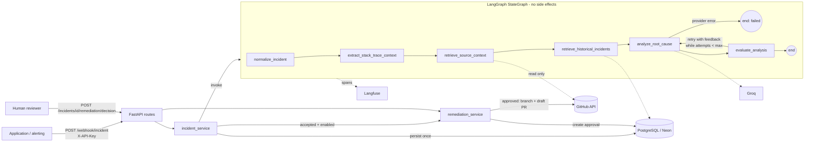

# OpsPulse AI

[](https://github.com/codcreater1/OpsPulse-AI-Autonomous-Incident-Response-RCA-Agent/actions/workflows/ci.yml)
 

An AI-powered incident investigation and root-cause analysis assistant that combines repository context,
historical incidents, bounded self-correction and human-reviewed GitHub remediation.

An application reports a crash to an HTTP API. OpsPulse locates the failing frame, reads the surrounding source
from an allow-listed GitHub repository, looks up similar past incidents, asks an LLM for a structured,
evidence-labelled root-cause analysis, and checks that analysis with a **deterministic quality gate**. If the
analysis is grounded and the proposed patch applies to the real source, it can propose a pull request -
which waits for an **explicit human approval** and is never merged automatically.

> **What it is not:** an autonomous bug fixer. The quality gate verifies that an analysis is *well-formed and
> grounded in the data that was actually retrieved*, and that the patch *applies*. It does not prove a fix is
> correct. No tests of the target repository are executed by the service.

---

## Contents

- [Features](#features) · [Architecture](#architecture) · [Workflow and statuses](#workflow-and-statuses)
- [Quality gate](#quality-gate) · [Evaluation](#evaluation) · [Retrieval](#retrieval)
- [Human approval](#human-approval-and-remediation-safety) · [Observability](#observability-langfuse)
- [Setup](#setup) · [API](#api) · [Testing and CI](#testing-and-ci) · [Demo](#demo)
- [Security](#security-model) · [Limitations](#known-limitations) · [Roadmap](#roadmap)

## Features

| Area | Implemented |
|---|---|
| Ingestion | `POST /webhook/incident` with validation, size limits, role-based API keys (fail-closed, stored as SHA-256), per-identity rate limit, repository allow-list, idempotent client-supplied `incident_id` |
| Orchestration | Compiled LangGraph `StateGraph`, one typed state contract, bounded retry loop (`MAX_ANALYSIS_ITERATIONS`) |
| Context | Stack-trace parsing (Python, JS, Java, Go), GitHub source window around the failing line, ranked same-repository history |
| Analysis | Groq (`llama-3.3-70b-versatile` by default) in JSON mode, validated by a Pydantic schema; every evidence item labelled *observed / inference / hypothesis* |
| Quality gate | Deterministic, weighted checks with *blocking* checks: schema, trigger frame, **verbatim evidence quotes**, file grounding, patch applies to retrieved source, locality, size |
| Remediation | Opt-in; policy-checked single-file diff; **human approval bound to the patch SHA-256 by an authenticated reviewer other than the submitter (four-eyes)**; deterministic branch per failure; duplicate-PR guard; draft PRs |
| Persistence | PostgreSQL/Neon via SQLAlchemy 2, Alembic migrations, failure taxonomy (`error_category`) |
| Observability | Structured JSON logs with incident correlation and secret redaction; Langfuse v4 traces with content masking by default |
| Evaluation | 26-case synthetic RCA dataset, deterministic metrics, mock and live modes; labelled retrieval dataset comparing two ranking strategies |
| Delivery | 153 offline unit tests (SQLite locally, PostgreSQL 16 in CI), opt-in live tests, GitHub Actions, Dockerfile + Compose, reproducible demo, ADRs |

## Architecture



| Module | Responsibility |
|---|---|
| `src/api/` | HTTP schemas (separate from graph state and DB models), routes, auth |
| `src/agent/state.py` | The single `IncidentState` contract and its semantics |
| `src/agent/nodes.py`, `graph.py` | Graph nodes and routing; dependencies (source fetcher, history lookup, model) are injected |
| `src/agent/prompts.py`, `schemas.py` | System prompt, untrusted-data delimiting, Pydantic output schema |
| `src/agent/evaluation.py` | Deterministic quality gate (pure functions) |
| `src/retrieval/history.py` | Historical-incident ranking strategies (pure functions) |
| `src/services/` | Side effects: persistence, remediation policy, approvals |
| `src/integrations/` | Groq, GitHub, Langfuse boundaries with error classification |
| `src/db/` | Engine, models, parameterized queries; `migrations/` holds Alembic revisions |
| `src/versions.py` | Prompt / evaluator / retrieval versions recorded with every analysis and report |
| `evals/` | Datasets, harness, metrics, runners |

Design decisions are recorded in [`docs/adr/`](docs/adr): the deterministic gate
([0001](docs/adr/0001-deterministic-quality-gate.md)), side effects outside the graph and no checkpointer
([0002](docs/adr/0002-side-effects-outside-the-graph.md)), lexical retrieval before embeddings
([0003](docs/adr/0003-lexical-retrieval-before-embeddings.md)).

**Why side effects live outside the graph:** the analysis node may run up to `MAX_ANALYSIS_ITERATIONS` times.
Keeping DB writes and GitHub calls in the service layer, after the graph finishes, makes it impossible for a
retry to open a second PR.

**Why no LangGraph checkpointer:** the graph runs to completion inside one request (seconds to a minute). The
only long pause - waiting for a human - happens *after* the graph, and everything needed to resume (analysis,
patch, pending approval) is already persisted in PostgreSQL. A checkpointer would add a second source of
truth without a demonstrated benefit. This is a deliberate decision, revisited in the roadmap.

## Workflow and statuses

1. **normalize_incident** - strips ANSI/NUL, caps sizes, separates a traceback embedded in the message.
2. **extract_stack_trace_context** - finds the application frame closest to the crash (library frames skipped).
3. **retrieve_source_context** - resolves the runtime path inside the repo tree and reads +/- 50 lines from the
   default branch. Missing file, missing token, permission or rate-limit errors degrade to "no source" and are
   stated explicitly in the prompt (`SOURCE NOT AVAILABLE (reason)`).
4. **retrieve_historical_incidents** - ranked, explained matches from the *same repository only*.
5. **analyze_root_cause** - one LLM attempt (`iterations += 1`). Malformed output counts as an attempt; provider
   failures (auth, rate limit, timeout, unknown model) end the workflow as `failed` - they are not retried by the
   loop (the SDK performs at most `LLM_MAX_RETRIES` transport retries).
6. **evaluate_analysis** - runs the gate and decides: `accepted`, retry with feedback, or `needs_review` (budget
   exhausted, model reported insufficient evidence, no source to ground a retry, or a grounded analysis that
   correctly proposes no code change).

Persisted incident `status` (with `error_category` explaining partial results / failures):

| Status | Meaning |
|---|---|
| `processing` | accepted, analysis running |
| `failed` | no usable analysis (`llm_*`, `internal_error`, `interrupted` - the process stopped mid-analysis) |
| `needs_review` | analysis stored but not accepted (`retry_budget_exhausted`, `insufficient_evidence`, `no_code_fix`, `source_unavailable`, `malformed_model_output`, `remediation_policy_violation`) |
| `analysis_ready` | accepted; remediation disabled or no token (`remediation_skipped`) |
| `awaiting_approval` | accepted; a PR proposal waits for a human decision |
| `remediation_rejected` | a reviewer rejected the proposal (`approval_rejected`) |
| `pr_created` / `pr_skipped_duplicate` / `pr_failed` | outcome of an approved (or approval-free) remediation (`github_*`) |

## Quality gate

`src/agent/evaluation.py` - no LLM call. Weights sum to 1.0; **blocking** checks must score 1.0 regardless of
the total, and the total must reach `QUALITY_THRESHOLD` (default 0.85).

| Check | Weight | Blocking | Verifies |
|---|---|---|---|
| `schema` | 0.10 | yes | reply validates against `RCAOutput` (Pydantic) |
| `trigger_grounding` | 0.10 | yes | `trigger_frame` names the real crashing file and line |
| `evidence_grounding` | 0.15 | yes | every *observed* evidence quote occurs verbatim in the source it cites (trace / retrieved code / history); quoting code that was never retrieved fails |
| `affected_files_grounding` | 0.05 | | listed files appear in the trace or are the retrieved file |
| `diff_wellformed` | 0.10 | yes | parseable single-file diff whose header is the affected file |
| `diff_applies` | 0.25 | yes | the diff applies to the retrieved source window |
| `patch_minimal` | 0.05 | | changed lines within `MAX_PATCH_CHANGED_LINES` |
| `patch_locality` | 0.10 | | a hunk lands within 30 lines of the failing line |
| `self_assessment` | 0.05 | | model's own confidence (uncalibrated, low weight, 0 if it asks for review) |
| `patch_effective` | 0.05 | yes | patch changes more than whitespace |

The resulting `quality_score` is a **rubric score, not a probability that the diagnosis is correct**.

**Evaluation limitations (measured, see below):** the gate cannot detect a *well-grounded but wrong*
diagnosis - in the mock dataset one deliberately mislabelled-but-grounded answer is accepted (false acceptance
1/17). It also cannot judge whether a patch is functionally right. False rejections are possible when a model
paraphrases code instead of quoting it; the feedback loop usually fixes that, at the cost of extra calls.

## Evaluation

```bash
python -m evals.run_rca --mode mock     # deterministic, offline, used in CI
python -m evals.run_rca --mode live     # real model; needs GROQ_API_KEY (26 cases, up to 3 calls each)
python -m evals.run_retrieval
```

Reports are written to `evals/reports/` as JSON (per-case facts + metrics + versions) and Markdown.

**Dataset** (`evals/datasets/rca_cases.json`, generated by `build_rca_cases.py`): 26 synthetic incidents -
AttributeError, ImportError/ModuleNotFoundError, DB connection refused / pool exhausted, invalid upstream JSON,
missing configuration, TypeErrors, KeyErrors, a misleading trace, missing source, an ambiguous worker crash,
contradictory evidence (running version != HEAD), a message-only report, prompt injection in the log, in history
and in a source comment, malformed and schema-invalid replies, recursion, an empty-list index, and a model that
never produces an applicable patch. **4 cases are labelled inconclusive** - the correct answer is "insufficient
evidence". Labels were written by the author; there is no independent annotation.

**Modes.** *Mock* replays scripted model replies stored in the dataset (including wrong, fabricated and
injection-compliant answers) through the real graph and gate - it measures the **evaluator and harness, not a
model**. *Live* uses the configured model and additionally reports latency, provider-reported token usage and an
optional cost estimate (`LLM_COST_*_PER_MTOK`).

**Metrics** (all deterministic ratios with stated numerator/denominator; `None` when the denominator is 0;
no LLM-as-judge is used):

| Metric | Definition |
|---|---|
| structured_output_validity | LLM attempts whose reply validated / LLM attempts (provider errors excluded) |
| category_accuracy | final `root_cause_category` == label / conclusive-labelled cases |
| evidence_grounding_accuracy | verified *observed* quotes / all *observed* quotes (final analyses) |
| unsupported_claim_rate | (unverifiable quotes + ungrounded affected files) / (all quotes + all affected files) |
| abstention_recall | inconclusive-labelled cases where the model declared insufficient evidence or `unknown` / inconclusive cases |
| inconclusive_not_accepted_rate | inconclusive-labelled cases the gate did **not** accept / inconclusive cases |
| false_abstention_rate | conclusive-labelled cases where the model abstained / conclusive cases |
| gate_acceptance_rate, false_acceptance_rate | accepted / all; (accepted and wrong-category or inconclusive) / accepted |
| relevant_file_hit_rate | cases whose affected files include a labelled file / cases with labelled files |
| avg_attempts, latency, tokens, estimated cost | from per-attempt records |

**Results actually obtained** (mock mode, 2026-10-09, `rca-cases-v1`, `quality-gate-v3`):

| Metric | Value |
|---|---|
| structured_output_validity | 0.938 (30/32) |
| category_accuracy | 0.955 (21/22) |
| evidence_grounding_accuracy | 0.980 (48/49) |
| unsupported_claim_rate | 0.027 (2/74) |
| abstention_recall | 0.750 (3/4) |
| inconclusive_not_accepted_rate | 1.000 (4/4) |
| false_acceptance_rate | 0.059 (1/17) |
| avg_attempts | 1.231 |

These numbers say the gate rejected every fabricated quote, injection-compliant answer and inapplicable patch
in the scripted set and accepted no inconclusive case. They say **nothing about how good the LLM is** - run live
mode for that. **No live-mode results are reported here because no Groq key was available while this was built.**

*An eval-driven change:* the first mock run showed four cases (missing dependency, DB down, pool exhausted,
missing env var) where a correct, grounded analysis without a patch burned all 3 attempts. `quality-gate-v3`
stops such analyses with `error_category=no_code_fix`: LLM calls on the dataset fell from 40 to 32 (average
attempts 1.538 -> 1.231) with every quality metric unchanged.

## Retrieval

Historical lookup is **lexical, not semantic**. The database returns the newest 200 eligible incidents of the
**same repository** (eligible = analyses that passed the gate); `lexical-v1` ranks them by failure fingerprint
(+3), same file (+1.5), same exception type (+1) and identifier-term overlap (Jaccard x2), drops matches below
1.2, collapses repeated deliveries of the same failure and returns at most 5 with human-readable `match_reasons`.
The original strategy (`fingerprint-or-file-v0`) is kept for comparison.

`evals/datasets/retrieval_cases.json`: 13 historical incidents in two repositories, 12 queries. Relevance is
labelled by construction (same repository and same author-assigned root-cause group).

| Strategy (k=3) | recall@3 | precision | MRR | empty_ok | cross-repo leaks | duplicates returned |
|---|---|---|---|---|---|---|
| fingerprint-or-file-v0 | 0.463 | 1.0 | 0.556 | 1.0 | 0 | 1 |
| lexical-v1 | 0.926 | 1.0 | 1.0 | 1.0 | 0 | 0 |

Recall below 1.0 comes only from intentionally collapsing a duplicate delivery. **Caveat:** the dataset and
`lexical-v1` were written by the same person, so this comparison is optimistic; it shows the mechanism is
measurable, not that it generalises. **Embeddings / pgvector were not added:** there is no evidence yet that
lexical ranking is the bottleneck, and embedding stack traces would send source-adjacent text to another
provider. See the roadmap.

## Human approval and remediation safety

Enforced in code (`src/services/remediation_service.py`), never by the model:

1. Remediation is **off** unless `ENABLE_GITHUB_REMEDIATION=true` and a token is present.
2. Patch policy: single file, header path == retrieved file, not under `.github/`, no `..`, at most
   `MAX_PATCH_CHANGED_LINES` changed lines, and it must apply to the **current default-branch head**.
3. With `REQUIRE_REMEDIATION_APPROVAL=true` (default) the incident stops in `awaiting_approval`. A client with
   the `reviewer` or `admin` role calls `POST /incidents/{id}/remediation/decision` with the `approval_id` **and
   the patch SHA-256** shown by `GET /incidents/{id}`. The reviewer is the authenticated identity, and it must
   differ from the identity that submitted the incident (four-eyes; `ALLOW_SELF_APPROVAL=false`). Reporters (403),
   self-approval (403), another incident's approval (404), a different/stale patch, an expired proposal
   (`APPROVAL_TTL_HOURS`) or an already-decided proposal (409) are refused. No decision = no action.
4. The approval row is claimed with a compare-and-set update *before* calling GitHub, so concurrent or repeated
   approvals cannot open two PRs; preconditions are re-checked at approval time.
5. Branch `opspulse/fix-<fingerprint>`; an existing open PR for that branch is reused; a PR for the same
   fingerprint within 24 h is not duplicated. PRs are drafts when supported and are never merged.
6. The PR body states that no tests were executed and lists evidence, uncertainties and suggested tests;
   `@` mentions from model text are neutralised.

*Limitation:* identities are API keys, not people - whoever holds the reviewer key can approve. Use one key per
person or system and rotate keys you suspect were shared.

## Observability (Langfuse)

Verified against **langfuse 4.17.0** (the SDK uses OpenTelemetry; the code uses `Langfuse(mask=...)`,
`start_as_current_observation` and `propagate_attributes`). With keys unset, everything is a no-op.

| Observation | Type | Content |
|---|---|---|
| `incident.process` (trace `opspulse.incident`, session = incident id) | chain | versions, final status, attempts, error category |
| graph node spans + LLM generation | via `langfuse.langchain.CallbackHandler` | model, latency, token usage reported by Groq |
| `retrieval.source_context`, `retrieval.historical_incidents` | retriever | found / match count / failure category |
| `evaluation.quality_gate` | evaluator | score, passed, attempt |
| `github.create_pull_request` | tool | outcome / error category |

**Privacy:** a mask function runs on every payload before export: credential-shaped strings are redacted and,
unless `LANGFUSE_CAPTURE_CONTENT=true`, any string longer than 200 characters (prompts, stack traces, source,
model output) is replaced by `[content omitted: N chars]`. Telemetry failures are logged and never break
processing. *Not verified against a live Langfuse project* (no keys were available); behaviour is covered by
unit tests with a fake client.

## Setup

Requirements: Python 3.11+, a PostgreSQL database (Neon works), a Groq API key. GitHub and Langfuse are optional.

**Windows (PowerShell)**

```powershell
py -3.11 -m venv .venv
.\.venv\Scripts\Activate.ps1
pip install -r requirements-dev.txt
Copy-Item .env.example .env   # then edit .env
alembic upgrade head
uvicorn src.main:app --reload --port 8000
```

**macOS / Linux (bash)**

```bash
python3.11 -m venv .venv
source .venv/bin/activate
pip install -r requirements-dev.txt
cp .env.example .env   # then edit .env
alembic upgrade head
uvicorn src.main:app --reload --port 8000
```

`.env.example` contains placeholders only. Required: `DATABASE_URL`, `API_KEYS` (or the legacy `API_KEY`),
`ALLOWED_REPOSITORIES`, `GROQ_API_KEY`. Without any key the incident endpoints return 503 (set
`ALLOW_UNAUTHENTICATED=true` only for local experiments).

**API keys and roles.** Create one key per client; only its SHA-256 goes into the configuration:

```bash
python -m scripts.make_api_key alertmanager reporter   # may submit and read incidents
python -m scripts.make_api_key alice reviewer          # may also approve/reject remediation
```

Append the printed `name:role:sha256` entries to `API_KEYS` (comma-separated) and hand each key to its client. GitHub token scopes: *Contents: Read* for analysis; additionally *Contents: Read & write* and
*Pull requests: Read & write* for remediation - fine-grained and limited to the allow-listed repositories.

**Database migrations.** The schema is owned by Alembic; the app never creates tables implicitly.
A database created by the first release (before Alembic): run `alembic stamp 0001` once, then `alembic upgrade head`.

**Docker**

```bash
docker compose up --build    # API on :8000 plus a local PostgreSQL; migrations run on container start
```

For Neon, remove the `db` service and set `DATABASE_URL` in `.env`.

## API

`GET /healthz` (liveness, public) · `GET /readyz` (database check, public, no details) · interactive docs at `/docs`.

```bash
curl -X POST "http://localhost:8000/webhook/incident?wait=true" \
  -H "X-API-Key: $API_KEY" -H "Content-Type: application/json" \
  -d '{"repo_name": "your-org/your-repo",
       "error_message": "TypeError: '\''NoneType'\'' object is not subscriptable",
       "stack_trace": "Traceback (most recent call last):\n  File \"/app/src/app.py\", line 6, in load_user\n    name = profile[\"name\"]\nTypeError: '\''NoneType'\'' object is not subscriptable"}'
```

Without `wait=true` the endpoint returns `202 {"incident_id": "...", "status": "processing"}`; poll
`GET /incidents/{id}`. Shape of a result (abridged; `<...>` are placeholders, not measured values):

```json
{
  "incident_id": "6f1c...", "status": "awaiting_approval", "error_category": null,
  "status_reason": "proposed PR is waiting for an explicit human decision",
  "quality_score": "<0..1>", "iterations": 1, "affected_file": "src/app.py",
  "analysis": {"root_cause_category": "null_reference", "evidence": ["..."], "uncertainties": ["..."],
               "tests_to_run": ["..."], "evaluation": {"quality_gate_passed": true, "checks": {"...": "..."}},
               "attempts": [{"iteration": 1, "latency_ms": "<ms>", "input_tokens": "<n>", "output_tokens": "<n>"}]},
  "suggested_patch": "--- a/src/app.py\n+++ b/src/app.py\n...",
  "pending_approval": {"approval_id": "b2e9...", "patch_sha256": "4be1...", "target_file": "src/app.py",
                       "action": "open_pull_request", "expires_at": "..."}
}
```

```bash
curl -X POST "http://localhost:8000/incidents/<incident_id>/remediation/decision" \
  -H "X-API-Key: $REVIEWER_KEY" -H "Content-Type: application/json" \
  -d '{"approval_id": "<approval_id>", "patch_sha256": "<patch_sha256>", "decision": "approve", "note": "looks right"}'
```

Errors always look like `{"error": {"code": "...", "message": "..."}}` and never echo submitted values,
stack traces or connection strings. Re-sending a request with the same `incident_id` returns the stored incident
(200) without re-running the analysis.

## Testing and CI

```bash
pytest                               # 153 offline unit tests (SQLite, fakes for Groq/GitHub/Langfuse)
pytest --cov=src --cov=evals         # coverage (86% total at time of writing)
ruff check src tests evals scripts migrations && ruff format --check src tests evals scripts migrations
mypy                                 # src/
RUN_LIVE_TESTS=1 pytest tests/integration -v   # opt-in, uses your real .env
```

Unit tests cover request validation and limits, auth (missing/wrong key, fail-closed), allow-list, idempotent
redelivery, stack-trace parsing, diff parsing/application (including multi-file smuggling), the quality gate
(passing and failing cases, fabricated quotes, unretrieved sources), schema validation, prompt-tag injection,
graph termination and retry budgets, provider-error classification, DB outages (503, never false success),
GitHub failures, approval binding/staleness/expiry/double-approval, retrieval ranking and repository isolation,
Alembic migrations vs. models, Langfuse enabled/disabled/broken, log redaction and the evaluation metrics.

`.github/workflows/ci.yml` (no secrets, `contents: read`) has three jobs:

- **quality** - ruff, format check, mypy, import smoke test, unit tests with coverage, mock evaluation with
  regression thresholds, retrieval evaluation (fails on any cross-repository leak) and the sandboxed demo;
- **postgres** - Alembic upgrade/downgrade/upgrade round trip, `alembic check` (models == migrated schema) and
  the unit tests against a PostgreSQL 16 service container;
- **docker** - builds the image.

The first CI run on GitHub caught a dependency that a stale local virtualenv had hidden (see CHANGELOG); the
workflow has run green on GitHub since. Contributor workflow: [CONTRIBUTING.md](CONTRIBUTING.md); security:
[SECURITY.md](SECURITY.md).

## Demo

```bash
python -m scripts.demo          # scripted (MOCK) model reply
python -m scripts.demo --live   # real Groq model
```

`examples/demo_service/` contains a small inventory module with a real bug (unknown SKU -> `None >= int`) and a
test that fails. The demo copies it to a temp directory, runs its tests (1 failed, 2 passed), reproduces the crash
in a subprocess, runs the OpsPulse graph on the real traceback, applies an accepted patch to the copy with the
pure-Python diff applier (generated code is never executed in-process) and re-runs the tests in a subprocess.
Local mock run: 3 passed after the patch. In mock mode the analysis is scripted, so this demonstrates the
pipeline, gate and sandboxed verification - **not** the model's ability. PR creation is not part of the demo.

## Security model

- Logs, traces, source files, history and model output are untrusted data. They are wrapped in delimiter tags
  that untrusted text cannot close (`[filtered-tag]`), and the system prompt says they are data. **Authorization
  never depends on the prompt:** repository access, allowed paths, patch shape, approval and duplicate checks are
  enforced in code, so a model that "obeys" an injection still cannot open a PR (tested).
- Fail-closed API key (constant-time compare); repository allow-list checked at the API and again in the GitHub
  client; repository names with `.`/`..` segments rejected.
- No secrets in code; `.env` is git-ignored; config errors name the variable, never the value; JSON logs redact
  GitHub/Groq/Langfuse tokens, bearer tokens and connection-string passwords; third-party HTTP loggers are quieted.
- GitHub errors are reduced to a category and a short message (no response bodies).
- **Residual risks:** a sophisticated injection could still bias the *content* of an analysis that a reviewer
  then trusts; the single shared API key has no per-user identity or rate limiting; the redaction patterns are
  best effort. If a real credential was ever committed to this repository's history, revoke and rotate it -
  deleting it in a later commit is not enough.

## Known limitations

- **Untested against live services:** Groq, GitHub branch/PR creation, Neon and Langfuse were exercised only
  through fakes. PostgreSQL is covered by the CI job (service container), and the Docker image builds in CI but
  has not been run end to end with Compose.
- Background processing uses FastAPI `BackgroundTasks`: an analysis interrupted by a crash is not resumed; it is
  marked `failed/interrupted` at the next startup and must be re-submitted.
- Single tenant: all identities share one repository allow-list; incidents are isolated per repository, not per
  identity. The rate limiter is per process.
- Path resolution maps runtime paths to repo files by suffix; monorepos with duplicate file names may resolve
  the wrong file, and very large repos may hit truncated git trees.
- Only the failing file (+/- 50 lines) is retrieved; root causes in callers outside that window are found only
  if the trace includes them.
- The remediation branch name is deterministic per failure; a stale branch from an earlier, closed PR blocks a
  new PR until it is deleted (enable "automatically delete head branches" on the repository).
- Evaluation labels and the retrieval dataset were authored by one person; metrics are indicative, not benchmarks.

## Roadmap

- Run the live evaluation and publish its report next to the mock baseline; add more real-world-shaped cases.
- Durable job execution (queue or LangGraph checkpointer with a PostgreSQL saver) so in-flight analyses survive
  restarts.
- PostgreSQL full-text search for candidate selection when histories outgrow the 200-row window; evaluate
  embeddings only if lexical recall proves insufficient on real data.
- Optional sandboxed execution of the target repository's tests before proposing a PR.

## Verified versions

Developed and tested on Windows with Python 3.11.9 and: fastapi 0.143.0, pydantic 2.14.0, SQLAlchemy 2.1.4,
alembic 1.20.0, langgraph 1.2.14, langchain-core 1.6.9, langchain-groq 1.1.3, groq 0.37.1, langfuse 4.17.0,
PyGithub 2.10.0, pytest 9.1.1, ruff 0.16.10, mypy 1.20.2. langfuse and langgraph were the latest releases on
PyPI at the time of checking (2026-10-09).

## License

MIT - see [LICENSE](LICENSE).

## Team responsibilities

The original split was Developer 1 (agent, prompts, evaluation, tracing) and Developer 2 (platform: database,
GitHub, ingestion, API). The modules above keep that boundary: `src/agent` + `src/integrations/llm.py` +
`observability.py` vs. `src/api`, `src/db`, `src/services`, `src/integrations/github.py`.
