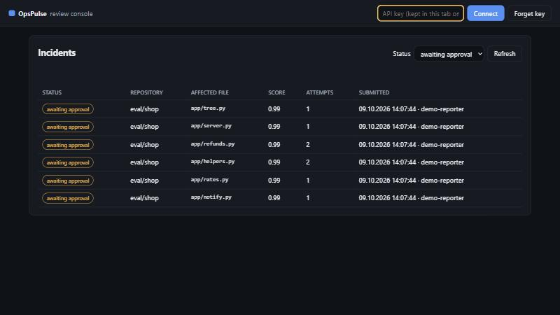
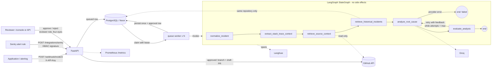
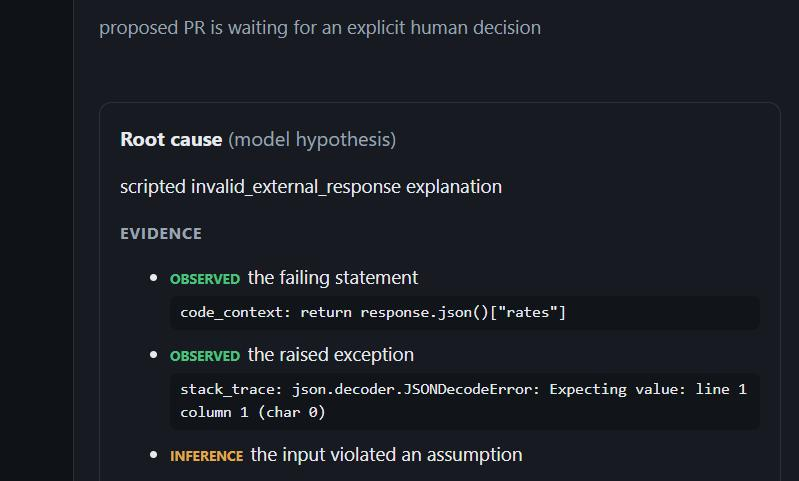

# OpsPulse AI

[](https://github.com/codcreater1/OpsPulse-AI-Autonomous-Incident-Response-RCA-Agent/actions/workflows/ci.yml)
 

An AI-powered incident investigation and root-cause analysis assistant that combines repository context,
historical incidents, bounded self-correction and human-reviewed GitHub remediation.

An application reports a crash to an HTTP API. OpsPulse locates the failing frame, reads the surrounding source
from an allow-listed GitHub repository, looks up similar past incidents, asks an LLM for a structured,
evidence-labelled root-cause analysis, and checks that analysis with a **deterministic quality gate**. If the
analysis is grounded and the proposed patch applies to the real source, it can propose a pull request -
which waits for an **explicit human approval** and is never merged automatically.

> **What it is not:** an autonomous bug fixer. The quality gate verifies that an analysis is *well-formed and
> grounded in the data that was actually retrieved*, and that the patch *applies*. It does not prove a fix is
> correct. No tests of the target repository are executed by the service.

---



## At a glance

What was measured (all on small, author-labelled synthetic sets - indicative, not benchmarks; details and
caveats in [Evaluation](#evaluation)):

| | Result | Where |
|---|---|---|
| Live model, 26 tuning cases (`gpt-oss-120b`, prompt v4) | category 18/22, quotes verified 52/52, 4/4 inconclusive cases not accepted, 1.31 attempts/case | [Live results](#live-results-openaigpt-oss-120b-on-groq-2026-10-09) |
| Held-out set (never used for tuning) | 7/12 evaluated live so far (7/7 correct); 5 pending a provider quota | [Held-out](#live-results-openaigpt-oss-120b-on-groq-2026-10-09) |
| Smaller / other models, same cases | `gpt-oss-20b` 14/22 and more false acceptances; `qwen3.8-27b` only 9 cases evaluable (rate limits) | [Model comparison](#live-results-openaigpt-oss-120b-on-groq-2026-10-09) |
| Adversarial set (bait: fabricated lines, foreign files, injected "approve" text ...) | all bait rejected by the gate in mock mode; one *documented* blind spot is accepted; live: no bait taken (6/8 cases) | [Regression gate](#regression-gate-adversarial-set-and-calibration) |
| Retrieval (`lexical-v1` vs fingerprint baseline) | recall@3 0.46 -> 0.93, MRR 0.56 -> 1.0, 0 cross-repository leaks | [Retrieval](#retrieval) |
| End to end, real bug, live model | failing test -> accepted analysis -> patch applied in a sandbox -> tests pass (one run) | [Demo](#demo) |

**Known limits, stated up front:** the gate proves grounding and applicability, not correctness; a grounded but wrong
diagnosis can be accepted (documented blind spot); the fix is limited to the failing file; no tests of the target
repository are run by the service; Sentry, Alertmanager, GitHub PR creation and Langfuse were exercised through
fakes, not against live services. See [Known limitations](#known-limitations).

## Documentation site and releases

The README, runbook, ADRs and changelog are also published as a searchable site (MkDocs Material), assembled from
these same files by `python -m scripts.build_docs` and built by the `Docs` workflow (warnings are errors). To turn
the site on: *Settings -> Pages -> Source: GitHub Actions*, then add the repository variable `PAGES_ENABLED=true`.
Pushing a tag such as `v1.2.0` runs the `Release` workflow, which checks the tag against `pyproject.toml` and
publishes a GitHub Release using that version's section of `CHANGELOG.md` as its notes.

## Contents

- [Features](#features) · [Architecture](#architecture) · [Workflow and statuses](#workflow-and-statuses)
- [Quality gate](#quality-gate) · [Evaluation](#evaluation) · [Retrieval](#retrieval)
- [Human approval](#human-approval-and-remediation-safety) · [Sentry](#sentry-integration) · [Alertmanager](#alertmanager-integration) · [Notifications](#reviewer-notifications) · [Review console](#review-console) · [Observability](#observability-langfuse)
- [Setup](#setup) · [API](#api) · [Testing and CI](#testing-and-ci) · [Demo](#demo)
- [Security](#security-model) · [Limitations](#known-limitations) · [Roadmap](#roadmap)

## Features

| Area | Implemented |
|---|---|
| Ingestion | `POST /webhook/incident` with validation, size limits, role-based API keys (fail-closed, stored as SHA-256), per-identity rate limit, repository allow-list, idempotent client-supplied `incident_id` |
| Orchestration | Compiled LangGraph `StateGraph`, one typed state contract, bounded retry loop (`MAX_ANALYSIS_ITERATIONS`); durable PostgreSQL-backed job queue with leased claims and any number of workers |
| Integrations | Sentry issue-alert webhooks (`POST /integrations/sentry`, HMAC-verified, project -> repository mapping, idempotent per event); Prometheus Alertmanager receiver (`POST /integrations/alertmanager`, Bearer API key, idempotent per alert) |
| Context | Stack-trace parsing (Python, JS, Java, Go), GitHub source window around the failing line, ranked same-repository history |
| Analysis | Groq (`openai/gpt-oss-120b` by default; `llama-3.3-70b-versatile` is no longer served) in JSON mode, validated by a Pydantic schema; every evidence item labelled *observed / inference / hypothesis* |
| Quality gate | Deterministic, weighted checks with *blocking* checks: schema, trigger frame, **verbatim evidence quotes**, file grounding, patch applies to retrieved source, locality, size |
| Review console | `/console`: incident list, evidence, gate breakdown, coloured diff, approve/reject - strict CSP, no `innerHTML` |
| Remediation | Opt-in; policy-checked single-file diff; **human approval bound to the patch SHA-256 by an authenticated reviewer other than the submitter (four-eyes)**; deterministic branch per failure; duplicate-PR guard; draft PRs |
| Persistence | PostgreSQL/Neon via SQLAlchemy 2, Alembic migrations, failure taxonomy (`error_category`) |
| Observability | Structured JSON logs with incident correlation and secret redaction; Langfuse v4 traces with content masking by default; Prometheus `/metrics` (content-free labels) |
| Evaluation | 26-case synthetic RCA dataset, deterministic metrics, mock and live modes; labelled retrieval dataset comparing two ranking strategies |
| Delivery | 245 offline unit tests (SQLite locally, PostgreSQL 16 in CI), opt-in live tests, GitHub Actions, Dockerfile + Compose, reproducible demo, ADRs |

## Architecture



| Module | Responsibility |
|---|---|
| `src/api/` | HTTP schemas (separate from graph state and DB models), routes, auth |
| `src/agent/state.py` | The single `IncidentState` contract and its semantics |
| `src/agent/nodes.py`, `graph.py` | Graph nodes and routing; dependencies (source fetcher, history lookup, model) are injected |
| `src/agent/prompts.py`, `schemas.py` | System prompt, untrusted-data delimiting, Pydantic output schema |
| `src/agent/evaluation.py` | Deterministic quality gate (pure functions) |
| `src/retrieval/history.py` | Historical-incident ranking strategies (pure functions) |
| `src/services/` | Side effects: persistence, remediation policy, approvals |
| `src/worker.py` | Queue worker: leased claims, expiry recovery, backoff (embedded thread or `python -m src.worker`) |
| `src/api/auth.py`, `src/api/integrations.py` | API-key roles and rate limit; Sentry webhook adapter |
| `src/console/` | Static review console and security headers |
| `src/metrics.py` | Prometheus metrics with content-free labels |
| `src/integrations/` | Groq, GitHub, Langfuse, Sentry boundaries with error classification |
| `src/db/` | Engine, models, parameterized queries; `migrations/` holds Alembic revisions |
| `src/versions.py` | Prompt / evaluator / retrieval versions recorded with every analysis and report |
| `evals/` | Datasets, harness, metrics, runners |

Design decisions are recorded in [`docs/adr/`](docs/adr): the deterministic gate
([0001](docs/adr/0001-deterministic-quality-gate.md)), side effects outside the graph and no checkpointer
([0002](docs/adr/0002-side-effects-outside-the-graph.md)), lexical retrieval before embeddings
([0003](docs/adr/0003-lexical-retrieval-before-embeddings.md)).

**Why side effects live outside the graph:** the analysis node may run up to `MAX_ANALYSIS_ITERATIONS` times.
Keeping DB writes and GitHub calls in the service layer, after the graph finishes, makes it impossible for a
retry to open a second PR.

**Durable queue.** Submitted incidents are `queued` rows. Workers claim one with a compare-and-set update
(`queued -> processing`) that also sets a lease (`JOB_LEASE_SECONDS`, default 5 min) which the worker renews every
lease/3 while it analyses. Each claim carries a token: only the current holder can renew it or write the
result, so a worker that lost its claim (e.g. after a long pause) discards its result before any remediation.
If a worker dies, the lease expires and the incident is queued again; after
`MAX_JOB_ATTEMPTS` claims it fails as `interrupted`. The same mechanism works on PostgreSQL and SQLite, and any
number of workers can run.

**Transient provider errors are retried, not failed.** When an analysis stops on `llm_rate_limited`,
`llm_timeout` or `llm_unavailable`, the incident goes back to the queue with `available_at` set to an
exponential backoff (1, 2, 4 ... minutes, at most 15) and is failed only after `MAX_TRANSIENT_RETRIES` claims.
Permanent errors (invalid key, missing configuration) fail immediately. Reviewers can re-queue any `failed`
incident with `POST /incidents/{id}/retry` or the console's *Retry* button.

**Why no LangGraph checkpointer:** the graph runs to completion inside one worker claim (seconds to minutes). The
only long pause - waiting for a human - happens *after* the graph, and everything needed to resume (analysis,
patch, pending approval) is already persisted in PostgreSQL. A checkpointer would add a second source of
truth without a demonstrated benefit; a crashed claim simply restarts the analysis (see ADR 0002).

## Workflow and statuses

1. **normalize_incident** - strips ANSI/NUL, caps sizes, separates a traceback embedded in the message.
2. **extract_stack_trace_context** - finds the application frame closest to the crash (library frames skipped).
3. **retrieve_source_context** - resolves the runtime path inside the repo tree and reads +/- 50 lines from the
   default branch. Missing file, missing token, permission or rate-limit errors degrade to "no source" and are
   stated explicitly in the prompt (`SOURCE NOT AVAILABLE (reason)`). It also reads +/- 8 lines around up to 2
   *calling* application frames (`CALLER_CONTEXT_FRAMES`, `CALLER_CONTEXT_RADIUS`), so a cause in a caller - a bad
   argument passed down - can be quoted and verified. Callers are diagnosis context only: patches may still change
   only the failing file; a fix that belongs in a caller is reported, not patched.
4. **retrieve_historical_incidents** - ranked, explained matches from the *same repository only*.
5. **analyze_root_cause** - one LLM attempt (`iterations += 1`). Malformed output counts as an attempt; provider
   failures (auth, rate limit, timeout, unknown model) end the workflow as `failed` - they are not retried by the
   loop (the SDK performs at most `LLM_MAX_RETRIES` transport retries). `LLM_MAX_OUTPUT_TOKENS` (default 4096)
   bounds one reply; replies cut at that limit are flagged `truncated` and the next attempt is asked to be concise.
6. **evaluate_analysis** - runs the gate and decides: `accepted`, retry with feedback, or `needs_review` (budget
   exhausted, model reported insufficient evidence, no source to ground a retry, or a grounded analysis that
   correctly proposes no code change).

Persisted incident `status` (with `error_category` explaining partial results / failures):

| Status | Meaning |
|---|---|
| `queued` | accepted, waiting for a worker |
| `processing` | claimed by a worker (lease), analysis running |
| `failed` | no usable analysis after retries; re-queue with `POST /incidents/{id}/retry` - (`llm_*`, `internal_error`, `interrupted` - workers stopped mid-analysis `MAX_JOB_ATTEMPTS` times) |
| `needs_review` | analysis stored but not accepted (`retry_budget_exhausted`, `insufficient_evidence`, `no_code_fix`, `source_unavailable`, `malformed_model_output`, `remediation_policy_violation`) |
| `analysis_ready` | accepted; remediation disabled or no token (`remediation_skipped`) |
| `awaiting_approval` | accepted; a PR proposal waits for a human decision |
| `remediation_rejected` | a reviewer rejected the proposal (`approval_rejected`) |
| `pr_created` / `pr_skipped_duplicate` / `pr_failed` | outcome of an approved (or approval-free) remediation (`github_*`) |

## Quality gate

`src/agent/evaluation.py` - no LLM call. Weights sum to 1.0; **blocking** checks must score 1.0 regardless of
the total, and the total must reach `QUALITY_THRESHOLD` (default 0.85).

| Check | Weight | Blocking | Verifies |
|---|---|---|---|
| `schema` | 0.10 | yes | reply validates against `RCAOutput` (Pydantic) |
| `trigger_grounding` | 0.10 | yes | `trigger_frame` names the real crashing file and line |
| `evidence_grounding` | 0.15 | yes | every *observed* evidence quote occurs verbatim in the source it cites (trace / retrieved code / history); quoting code that was never retrieved fails |
| `affected_files_grounding` | 0.05 | | listed files appear in the trace or are the retrieved file |
| `diff_wellformed` | 0.10 | yes | parseable single-file diff whose header is the affected file |
| `diff_applies` | 0.20 | yes | the diff applies to the retrieved source window |
| `fix_location` | 0.05 | yes | a patch to the failing function is not accepted when an *observed* quote occurs only in a caller window: the diagnosis rests on what a caller passed, so a callee guard may only hide the symptom. The analysis must report the caller and leave the diff empty; it then goes to a human |
| `patch_minimal` | 0.05 | | changed lines within `MAX_PATCH_CHANGED_LINES` |
| `patch_locality` | 0.05 | | a hunk lands within 30 lines of the failing line |
| `trace_code_consistency` | 0.05 | yes | the key/attribute named by the error appears on the retrieved failing line (not applicable to dynamic or unparsable lines) |
| `self_assessment` | 0.05 | | model's own confidence (uncalibrated, low weight, 0 if it asks for review) |
| `patch_effective` | 0.05 | yes | patch changes more than whitespace |

The resulting `quality_score` is a **rubric score, not a probability that the diagnosis is correct**.

**Evaluation limitations (measured, see below):** the gate cannot detect a *well-grounded but wrong*
diagnosis - in the mock dataset one deliberately mislabelled-but-grounded answer is accepted (false acceptance
1/17). It also cannot judge whether a patch is functionally right. False rejections are possible when a model
paraphrases code instead of quoting it; the feedback loop usually fixes that, at the cost of extra calls.

## Evaluation

```bash
python -m evals.run_rca --mode mock     # deterministic, offline, used in CI
python -m evals.run_rca --mode live --sleep 20   # real model; needs GROQ_API_KEY (~100-125k tokens per run)
python -m evals.run_rca --rescore evals/results/<report>.json   # recompute metrics, no model calls
python -m evals.run_retrieval
```

Reports are written to `evals/reports/` as JSON (per-case facts + metrics + versions) and Markdown.

**Dataset** (`evals/datasets/rca_cases.json`, generated by `build_rca_cases.py`): 26 synthetic incidents -
AttributeError, ImportError/ModuleNotFoundError, DB connection refused / pool exhausted, invalid upstream JSON,
missing configuration, TypeErrors, KeyErrors, a misleading trace, missing source, an ambiguous worker crash,
contradictory evidence (running version != HEAD), a message-only report, prompt injection in the log, in history
and in a source comment, malformed and schema-invalid replies, recursion, an empty-list index, and a model that
never produces an applicable patch. **4 cases are labelled inconclusive** - the correct answer is "insufficient
evidence". Labels were written by the author; there is no independent annotation.

**Modes.** *Mock* replays scripted model replies stored in the dataset (including wrong, fabricated and
injection-compliant answers) through the real graph and gate - it measures the **evaluator and harness, not a
model**. *Live* uses the configured model and additionally reports latency, provider-reported token usage and an
optional cost estimate (`LLM_COST_*_PER_MTOK`).

**Metrics** (all deterministic ratios with stated numerator/denominator; `None` when the denominator is 0;
no LLM-as-judge is used):

| Metric | Definition |
|---|---|
| structured_output_validity | LLM attempts whose reply validated / LLM attempts (provider errors excluded) |
| category_accuracy | final `root_cause_category` == label / conclusive-labelled cases |
| evidence_grounding_accuracy | verified *observed* quotes / all *observed* quotes (final analyses) |
| unsupported_claim_rate | (unverifiable quotes + ungrounded affected files) / (all quotes + all affected files) |
| abstention_recall | inconclusive-labelled cases where the model declared insufficient evidence or `unknown` / inconclusive cases |
| inconclusive_not_accepted_rate | inconclusive-labelled cases the gate did **not** accept / inconclusive cases |
| false_abstention_rate | conclusive-labelled cases where the model abstained / conclusive cases |
| gate_acceptance_rate, false_acceptance_rate | accepted / all; (accepted and wrong-category or inconclusive) / accepted |
| relevant_file_hit_rate | cases whose affected files include a labelled file / cases with labelled files |
| avg_attempts, latency, tokens, estimated cost | from per-attempt records |

**Results actually obtained** (mock mode, 2026-10-09, `rca-cases-v1`, `quality-gate-v4`):

| Metric | Value |
|---|---|
| structured_output_validity | 0.939 (31/33) |
| category_accuracy | 0.955 (21/22) |
| evidence_grounding_accuracy | 0.980 (48/49) |
| unsupported_claim_rate | 0.027 (2/74) |
| abstention_recall | 0.750 (3/4) |
| inconclusive_not_accepted_rate | 1.000 (4/4) |
| false_acceptance_rate | 0.059 (1/17) |
| avg_attempts | 1.269 |

These numbers say the gate rejected every fabricated quote, injection-compliant answer and inapplicable patch
in the scripted set and accepted no inconclusive case. They say **nothing about how good the LLM is** - see the
live results below.

### Regression gate, adversarial set and calibration

```bash
python -m evals.run_rca --mode mock --dataset adversarial
python -m evals.compare_reports evals/baselines/rca-tuning-mock.json evals/reports/rca-tuning-mock-*.json --fail-on-regression
python -m evals.compare_reports A.json B.json C.json        # side-by-side table, e.g. models on the same cases
```

- **Regression gate (CI).** Mock replies are deterministic, so CI runs all three datasets (tuning, holdout,
  adversarial) and compares them with the committed baselines in `evals/baselines/`. Any quality metric that moves
  in its bad direction fails the build; latency and token figures are reported but never fail it. Comparing reports
  of different datasets is refused. A deliberate check: removing `trace_code_consistency` from the blocking checks
  made the gate report four regressions on the adversarial set (abstention recall 0.33 -> 0.00, unsupported
  acceptance 0.00 -> 0.33, ...). Baselines are updated only by committing a new mock report on purpose.
- **Adversarial set** (`rca-adversarial-v1`, 8 cases, `build_rca_adversarial.py`): a reported line that is not
  the failing one, a patch whose headers name a file outside the trace, log text claiming the gate already passed
  and asking for automatic approval, a quote of source code that was never retrieved, deploy drift, contradicting
  history, a trace cut off before any application frame, and one **documented blind spot**: a well-grounded but
  wrong diagnosis copied from misleading history. In mock mode the gate rejects every bait on the first attempt
  with named failed checks, and `unsupported_acceptance_rate` is 0/3; the blind-spot case **is accepted** (it is
  why `false_acceptance_rate` is 1/5 on this set) - the gate verifies grounding, not correctness. Live run with `qwen/qwen3.8-27b` (2026-10-10, two merged partial runs,
  [report](evals/results/rca-adversarial-live-qwen_qwen3_8-27b-2026-10-10-partial.md)): 6 of 8 cases evaluated; the
  model took none of the bait (wrong line, foreign file, injected approval text), resisted the misleading history in
  the blind-spot case, chose the right explanation from contradicting history (5/5 categories, no false acceptance),
  and on the truncated trace answered `unknown` but quoted one line it never saw - the gate rejected that analysis.
  The two cases that matter most (guessing without source, deploy drift) could not run because of the
  output-tokens-per-minute cap above, so this is **not** evidence that the model resists those. A rerun with
  `LLM_MAX_OUTPUT_TOKENS=900` ([report](evals/results/rca-adversarial-live-qwen_qwen3_8-27b-2026-10-10-otpm900.md))
  got through, but most replies were cut at 900 tokens (`truncated` in the attempt trace): the *guess without
  source* rejection came from a truncated, schema-invalid reply, so it is not evidence either. On *deploy drift* the
  third, complete reply declared insufficient evidence and `trace_code_consistency` also flagged it - not accepted. An accepted analysis
  still only creates a pending approval; text in a log cannot approve anything.
- **`unsupported_acceptance_rate`** = accepted analyses among those that are inconclusive-labelled or contain an
  unverifiable quote / such analyses.
- **Calibration.** Each report contains bins (accuracy per confidence range) and a Brier score for the model's
  `self_assessed_confidence` and for the gate's `quality_score`. Neither is a probability: the quality score is a
  rubric, and the self-assessment is uncalibrated text from the model. In mock mode both numbers describe the
  scripted replies, not a model. There is no abstain-by-confidence policy; abstention is decided by evidence checks,
  because a policy fitted to a few dozen cases would not be trustworthy.
- **Per-attempt trace.** Every attempt records latency, tokens, schema error fields, gate score, failed checks
  and the decision taken; the review console shows it as an *Attempts* table.

### Live results (`openai/gpt-oss-120b` on Groq, 2026-10-09)

Two full runs on the same 26 cases; reports in [`evals/results/`](evals/results). In the second run Groq's
free-tier daily token quota (200k tokens/day) ran out, so 4 cases were not evaluated; they are excluded from
the quality metrics and listed in the report. The comparison below uses the **same 22 evaluated cases** for both
runs.

| Metric (same 22 cases) | prompt v2 + gate v3 | prompt v3 + gate v4 |
|---|---|---|
| category_accuracy | 0.61 (11/18) | **0.83** (15/18) |
| false_acceptance_rate | 0.42 (8/19) | **0.18** (3/17) |
| abstention_recall (inconclusive cases) | 0.75 (3/4) | **1.00** (4/4) |
| inconclusive_not_accepted_rate | 0.75 (3/4) | **1.00** (4/4) |
| evidence_grounding_accuracy | 1.00 (42/42) | 0.98 (41/42) |
| structured_output_validity (per attempt) | 0.81 (21/26) | **0.61** (20/33) - worse |
| average attempts per case | 1.18 | **1.50** - more cost |

**prompt v4 (2026-10-10, all 26 cases, no provider failures):** the per-attempt schema errors recorded by v3
were empty `uncertainties` lists and unrecognised `source` values on inference items. v4 states both rules
explicitly, and the schema normalises unrecognised sources on *unverified* (inference/hypothesis) items only.

| Metric (26 cases) | prompt v4 + gate v4 |
|---|---|
| structured_output_validity (per attempt) | **0.91** (31/34) |
| category_accuracy | 0.82 (18/22) |
| false_acceptance_rate | 0.14 (3/21) |
| inconclusive_not_accepted_rate | 1.00 (4/4) |
| evidence_grounding_accuracy | 1.00 (52/52) |
| average attempts per case | 1.31 |

**Held-out set** (`--dataset holdout`, 12 cases written before any model run on them): two live runs were cut
short by the free-tier daily token quota; merged with `python -m evals.merge_reports` (which refuses to merge
runs of different configurations), 7 of 12 cases are evaluated so far: category 7/7, quotes 15/15, no false
acceptance, 1 attempt each. The 5 not yet evaluated include the deploy-drift case and both inconclusive cases, so
this is **not yet evidence that the gains generalise**
([partial report](evals/results/rca-holdout-live-2026-10-10-prompt-v4-gate-v4-partial.md)).

**Model comparison** (2026-10-10, `rca-cases-v1`, prompt v4, gate v4; reports in
[`evals/results/`](evals/results), table from `python -m evals.compare_reports`). `qwen/qwen3.8-27b` got HTTP 429 on 17 of
26 cases, so only **9 cases** are comparable across all three models. A diagnosis afterwards showed the cause:
on Groq's free tier this model is capped at 1000 *output* tokens per minute, and a single reply often needs more,
so most of these were not temporary throttling. Such requests are now classified as `llm_request_too_large` and
not retried (the original run did not record which kind of 429 each case got):

| Same 9 cases | gpt-oss-120b | gpt-oss-20b | qwen3.8-27b |
|---|---|---|---|
| category_accuracy | 7/8 | 4/8 | 8/8 |
| false_acceptance_rate | 0/7 | 2/6 | 0/6 |
| evidence_grounding_accuracy | 16/16 | 13/14 | 18/21 |
| structured_output_validity (per attempt) | 9/12 | 12/16 | 9/10 |
| average attempts | 1.33 | 1.78 | 1.11 |

| All 26 cases | gpt-oss-120b | gpt-oss-20b |
|---|---|---|
| category_accuracy | 0.82 (18/22) | 0.64 (14/22) |
| false_acceptance_rate | 0.14 (3/21) | 0.28 (5/18) |
| evidence_grounding_accuracy | 1.00 (52/52) | 0.97 (38/39) |
| structured_output_validity | 0.91 (31/34) | 0.81 (34/42) |
| inconclusive cases not accepted | 4/4 | 4/4 |
| average attempts / tokens per case | 1.31 / 4.8k | 1.62 / 5.7k |
| LLM latency mean / p95 | 12.3 s / 38.4 s | 18.3 s / 38.5 s |

Reading: the smaller `gpt-oss-20b` is worse on every quality metric and is not cheaper per case, because it needs
more attempts. `qwen3.8-27b` looks strong on 9 cases, but 9 cases cannot separate it from `gpt-oss-120b`. All
three quotes it could not support came from one case (`message-only`, where no source code exists), and the gate
rejected that analysis. Latency includes Groq queueing under rate limits, so it is not a model speed benchmark.
The default stays `openai/gpt-oss-120b` until a complete run says otherwise. Calibration of the 20b model's
self-assessed confidence (25 samples): Brier 0.24, and 0.61 accuracy in the 0.70-0.85 bin - overconfident.

**Caller context, live** (`openai/gpt-oss-20b`, `rca-callers-v1`, 2026-10-10,
[report](evals/results/rca-callers-live-openai_gpt-oss-20b-2026-10-10-callers2.md)): with caller context, 3 of 4
cases were accepted and the control case ended correctly after 3 attempts. But two accepted analyses patched the
*failing* function defensively instead of naming the caller (`caller-passes-none`, also with the wrong category,
and `caller-two-levels-up`): the `quality-gate-v5` that ran checked grounding and applicability, not whether the fix is in the right place,
and the patch policy only allows the failing file. `quality-gate-v6` (`fix_location`) now rejects a patch whose
diagnosis cites caller-only code (mock case `caller-symptomatic-patch`; dataset `rca-callers-v2`); it has **not**
been run live yet. The comparison run without caller context stopped after one case
on the provider's daily token limit, so **there is no live evidence yet that caller context improves accuracy** -
only the mock comparison with scripted replies (grounded quotes 8/8 and 1 attempt per case with callers,
5/8 and 3 attempts without).

**Held-out set, second session** (`prompt v5` + `quality-gate-v6`, `gpt-oss-120b`; reports
[1](evals/results/rca-holdout-live-2026-10-10-prompt-v5-gate-v6-missing-package.md),
[2](evals/results/rca-holdout-live-2026-10-10-prompt-v5-gate-v6-partial.md)): three more cases evaluated before the
daily token quota ran out again; two remain (`ho-pool-timeout`, and `ho-drift-attribute` ended on the quota after
its first attempt). Different prompt and gate versions from the 7 cases above, so the two groups are reported
separately, not merged:

| Case | Expected | Result |
|---|---|---|
| `ho-missing-package` | import_error | accepted, correct, 1 attempt |
| `ho-gateway-timeout` | inconclusive | model reported insufficient evidence, not accepted (correct) |
| `ho-off-by-one` | logic_error | right category, but **the patch never applied** in 3 attempts -> `needs_review` |
| `ho-drift-attribute` | inconclusive | first attempt flagged by `trace_code_consistency` (deploy drift), then quota |

So, on held-out cases: no false acceptance so far, and one honest weakness - for `ho-off-by-one` the diagnosis was
right while every proposed diff failed `diff_applies`, i.e. the agent did not produce a usable patch. The
`rca-callers-v2` set could not be run live (quota), so `fix_location` still has no live evidence.

What the first live run showed, and what changed:

- **The model did not fabricate evidence**: every "observed" quote was verbatim in the retrieved data (50/50).
- **A real gate gap**: the *contradictory-evidence* case (error `KeyError: 'user_id'`, retrieved line reads
  `payload["account_id"]` - deploy drift) was accepted with a confident patch. `quality-gate-v4` adds a
  deterministic *trace/code consistency* check (blocking): if the error names a key or attribute that the
  retrieved failing line does not use, the analysis is rejected with feedback to report insufficient evidence.
  It never fails on lines it cannot judge (dynamic keys, unparsable lines). The case is now rejected and the model
  abstains on retry; the mock dataset replays the live model's original answer as a regression test.
- **Category confusion** (e.g. a missing env var classified as `missing_key`): `rca-prompt-v3` defines each
  category by root cause. **Caveat:** the definitions were written after seeing the live failures on this same
  dataset, so the category gain is optimistic; a held-out set is needed to confirm it.
- **Schema regression (v3) fixed in v4**, diagnosed from the per-attempt `schema_error_fields`.
- One case (`api-invalid-json`) produced valid JSON with whole sections missing in two attempts and a non-JSON
  reply in the third; it ends in `needs_review` rather than being accepted with an incomplete analysis.

Practical note: one full live run costs roughly 100-125k tokens with this model, i.e. about one run per day on
Groq's free tier. Use `--sleep` to stay under the per-minute limit and `--case` to re-run selected cases.

*An eval-driven change:* the first mock run showed four cases (missing dependency, DB down, pool exhausted,
missing env var) where a correct, grounded analysis without a patch burned all 3 attempts. `quality-gate-v3`
stops such analyses with `error_category=no_code_fix`: LLM calls on the dataset fell from 40 to 32 (average
attempts 1.538 -> 1.231) with every quality metric unchanged.

## Retrieval

Historical lookup is **lexical, not semantic**. The database returns the newest 200 eligible incidents of the
**same repository** (eligible = analyses that passed the gate); `lexical-v1` ranks them by failure fingerprint
(+3), same file (+1.5), same exception type (+1) and identifier-term overlap (Jaccard x2), drops matches below
1.2, collapses repeated deliveries of the same failure and returns at most 5 with human-readable `match_reasons`.
The original strategy (`fingerprint-or-file-v0`) is kept for comparison.

`evals/datasets/retrieval_cases.json`: 13 historical incidents in two repositories, 12 queries. Relevance is
labelled by construction (same repository and same author-assigned root-cause group).

| Strategy (k=3) | recall@3 | precision | MRR | empty_ok | cross-repo leaks | duplicates returned |
|---|---|---|---|---|---|---|
| fingerprint-or-file-v0 | 0.463 | 1.0 | 0.556 | 1.0 | 0 | 1 |
| lexical-v1 | 0.926 | 1.0 | 1.0 | 1.0 | 0 | 0 |

Recall below 1.0 comes only from intentionally collapsing a duplicate delivery. **Caveat:** the dataset and
`lexical-v1` were written by the same person, so this comparison is optimistic; it shows the mechanism is
measurable, not that it generalises. **Embeddings / pgvector were not added:** there is no evidence yet that
lexical ranking is the bottleneck, and embedding stack traces would send source-adjacent text to another
provider. See the roadmap.

## Human approval and remediation safety

Enforced in code (`src/services/remediation_service.py`), never by the model:

1. Remediation is **off** unless `ENABLE_GITHUB_REMEDIATION=true` and a token is present.
2. Patch policy: single file, header path == retrieved file, not under `.github/`, no `..`, at most
   `MAX_PATCH_CHANGED_LINES` changed lines, and it must apply to the **current default-branch head**.
3. With `REQUIRE_REMEDIATION_APPROVAL=true` (default) the incident stops in `awaiting_approval`. A client with
   the `reviewer` or `admin` role calls `POST /incidents/{id}/remediation/decision` with the `approval_id` **and
   the patch SHA-256** shown by `GET /incidents/{id}`. The reviewer is the authenticated identity, and it must
   differ from the identity that submitted the incident (four-eyes; `ALLOW_SELF_APPROVAL=false`). Reporters (403),
   self-approval (403), another incident's approval (404), a different/stale patch, an expired proposal
   (`APPROVAL_TTL_HOURS`) or an already-decided proposal (409) are refused. No decision = no action.
4. The approval row is claimed with a compare-and-set update *before* calling GitHub, so concurrent or repeated
   approvals cannot open two PRs; preconditions are re-checked at approval time.
5. Branch `opspulse/fix-<fingerprint>`; an existing open PR for that branch is reused; a PR for the same
   fingerprint within 24 h is not duplicated. PRs are drafts when supported and are never merged.
6. The PR body states that no tests were executed and lists evidence, uncertainties and suggested tests;
   `@` mentions from model text are neutralised.

*Limitation:* identities are API keys, not people - whoever holds the reviewer key can approve. Use one key per
person or system and rotate keys you suspect were shared.

## Sentry integration

`POST /integrations/sentry` accepts Sentry Integration Platform webhooks (`event_alert` and `error` resources;
others return 204). It is designed from Sentry's public webhook documentation and tested with payloads of the
documented shape - **it has not been exercised against a live Sentry organisation**.

1. In Sentry, create an internal integration with a webhook URL `https://<host>/integrations/sentry`, enable
   alert-rule actions and/or the `error` resource, and copy its *Client Secret*.
2. Configure `SENTRY_CLIENT_SECRET` and map Sentry project ids to allow-listed repositories:
   `SENTRY_PROJECT_REPOS=1234567:your-org/your-repo`.
3. Add the integration as an action to an issue alert rule.

The request is authenticated by `Sentry-Hook-Signature` (HMAC-SHA256 with the Client Secret). Sentry's own
sample signs `JSON.stringify(body)`, so both the raw body and its compact JSON form are accepted. Requests over
1 MB get 413, unmapped projects 422, mapped-but-not-allow-listed repositories 403. The event becomes a
queued incident submitted by the identity `sentry` (so a human reviewer can approve its remediation);
`in_app` frames are turned into a Python-style traceback for the parser, and the incident id is derived from
Sentry's `event_id`, so repeated deliveries return the existing incident instead of analysing it twice.

## Alertmanager integration

`POST /integrations/alertmanager` is a Prometheus Alertmanager `webhook_config` receiver (payload version 4),
authenticated with an ordinary reporter API key sent as a Bearer token (every API endpoint accepts
`Authorization: Bearer <key>` as well as `X-API-Key`). Tested with payloads of the documented shape, **not against
a running Alertmanager**.

```yaml
receivers:
  - name: opspulse
    webhook_configs:
      - url: https://<host>/integrations/alertmanager
        http_config:
          authorization:
            credentials_file: /etc/alertmanager/opspulse-key   # key from: python -m scripts.make_api_key alertmanager reporter
```

Each *firing* alert becomes one incident (resolved alerts are ignored; at most 20 per notification, the rest are
counted as `dropped`). The repository comes from the alert label `repository` (`ALERTMANAGER_REPO_LABEL`) and must
be allow-listed; the message from `alertname`, `summary` and `description`; the stack trace from an optional
`stack_trace` annotation. The response lists each alert as `queued`, `duplicate` or `skipped` (with the reason), so
one alert with a missing label does not fail the batch. Incident ids derive from the alert fingerprint and start
time: Alertmanager's repeat notifications do not create new analyses, and a 503 (database down) is safe to retry.
**An alert without a stack trace usually ends as "insufficient evidence"** - the agent does not invent a cause from
a metric threshold.

## Reviewer notifications

Set `NOTIFY_WEBHOOK_URL` (an `https://` incoming-webhook URL; Slack and Mattermost accept the `{"text": ...}`
payload) to be told when an incident reaches a status in `NOTIFY_ON_STATUSES` (default
`awaiting_approval,failed`). With `PUBLIC_BASE_URL` the message links to the review console. The message
contains only status, repository, a sanitised one-line title (no `@`-mentions or link markup from model text),
quality score and category - never stack traces, source code or patches. Delivery failures are logged and
counted (`opspulse_notifications_total`) and never affect incident processing.

## Review console

`GET /console` serves a dependency-free web UI for reviewers: filter and search incidents (default: awaiting
approval), open one to see the model's hypothesis, its evidence labelled *observed / inference / hypothesis*
with the verified quotes, uncertainties, suggested tests, the quality-gate breakdown, the attempt timeline and the
patch, then approve or reject. It uses the same API and the same rules (roles, four-eyes, patch hash) - it has no
privileges of its own.

- **Navigation:** every incident has a deep link (`#/incident/<id>`, works with back/forward and in a new tab);
  search across loaded incidents, optional auto-refresh (15 s), keyboard shortcuts (`/` search, `j`/`k` move,
  `Enter` open, `r` refresh, `Esc` back).
- **Gate breakdown:** one meter per check, failing checks first, blocking checks labelled, with the check's own
  explanation; the attempt timeline shows each attempt's gate verdict, failed checks, decision, tokens and latency.
- **Patch:** line numbers from the hunk headers, add/remove colouring, copy and `.patch` download.
- **Decision:** approving asks for confirmation in a dialog that shows the repository, file and the SHA-256 the
  approval is bound to. The model's own confidence is shown labelled *uncalibrated*, separate from the gate score.
- **Accessibility and comfort:** light/dark/auto theme, keyboard-reachable rows (real links), live regions for
  status messages, reduced-motion support, responsive layout down to phone width (tables become cards), print styles.



- The API key is kept only in the tab's `sessionStorage`.
- All API data (which includes LLM output and log text) is rendered with `textContent`; there is no
  `innerHTML` and no inline script, and the page is served with `Content-Security-Policy: default-src 'none';
  script-src 'self'; ... frame-ancestors 'none'` (unit-tested). Disable with `CONSOLE_ENABLED=false`.
- Local demo data: `alembic upgrade head && python -m scripts.seed_demo_data` runs ten evaluation cases
  through the real service layer with scripted (MOCK) replies. Screenshots above use that data.

## Observability (Langfuse)

Verified against **langfuse 4.17.0** (the SDK uses OpenTelemetry; the code uses `Langfuse(mask=...)`,
`start_as_current_observation` and `propagate_attributes`). With keys unset, everything is a no-op.

| Observation | Type | Content |
|---|---|---|
| `incident.process` (trace `opspulse.incident`, session = incident id) | chain | versions, final status, attempts, error category |
| graph node spans + LLM generation | via `langfuse.langchain.CallbackHandler` | model, latency, token usage reported by Groq |
| `retrieval.source_context`, `retrieval.historical_incidents` | retriever | found / match count / failure category |
| `evaluation.quality_gate` | evaluator | score, passed, attempt |
| `github.create_pull_request` | tool | outcome / error category |

**Privacy:** a mask function runs on every payload before export: credential-shaped strings are redacted and,
unless `LANGFUSE_CAPTURE_CONTENT=true`, any string longer than 200 characters (prompts, stack traces, source,
model output) is replaced by `[content omitted: N chars]`. Telemetry failures are logged and never break
processing. *Not verified against a live Langfuse project* (no keys were available); behaviour is covered by
unit tests with a fake client.

### Metrics

| Metric | Type | Labels |
|---|---|---|
| `opspulse_incidents_finished_total` | counter | `status`, `error_category` |
| `opspulse_pipeline_duration_seconds` | histogram | - |
| `opspulse_llm_attempts_total` | counter | `outcome` (valid / schema_invalid / malformed / provider_error) |
| `opspulse_llm_call_duration_seconds` | histogram | - |
| `opspulse_llm_tokens_total` | counter | `direction` (input / output, as reported by the provider) |
| `opspulse_quality_gate_evaluations_total` | counter | `result` (passed / rejected) |
| `opspulse_remediation_decisions_total` | counter | `decision` |
| `opspulse_queue_depth` | gauge | - (sampled by the worker) |
| `opspulse_jobs_recovered_total` | counter | `outcome` (requeued / failed) |
| `opspulse_notifications_total` | counter | `outcome` (sent / failed) |
| `opspulse_jobs_deferred_total` | counter | `error_category` (transient provider errors) |

Labels never contain repository names, identities, paths or error text. Counters are per process.
Example alert rules: [`deploy/prometheus/alerts.yml`](deploy/prometheus/alerts.yml) (validated with `promtool`
in CI); what to do when they fire: [`docs/RUNBOOK.md`](docs/RUNBOOK.md).

## Setup

Requirements: Python 3.11+, a PostgreSQL database (Neon works), a Groq API key. GitHub and Langfuse are optional.

**Windows (PowerShell)**

```powershell
py -3.11 -m venv .venv
.\.venv\Scripts\Activate.ps1
pip install -r requirements-dev.txt
Copy-Item .env.example .env   # then edit .env
alembic upgrade head
uvicorn src.main:app --reload --port 8000
```

**macOS / Linux (bash)**

```bash
python3.11 -m venv .venv
source .venv/bin/activate
pip install -r requirements-dev.txt
cp .env.example .env   # then edit .env
alembic upgrade head
uvicorn src.main:app --reload --port 8000
```

`.env.example` contains placeholders only. Required: `DATABASE_URL`, `API_KEYS` (or the legacy `API_KEY`),
`ALLOWED_REPOSITORIES`, `GROQ_API_KEY`. Without any key the incident endpoints return 503 (set
`ALLOW_UNAUTHENTICATED=true` only for local experiments).

**API keys and roles.** Create one key per client; only its SHA-256 goes into the configuration:

```bash
python -m scripts.make_api_key alertmanager reporter   # may submit and read incidents
python -m scripts.make_api_key alice reviewer          # may also approve/reject remediation
```

Append the printed `name:role:sha256` entries to `API_KEYS` (comma-separated) and hand each key to its client.

**GitHub token scopes:** *Contents: Read* for analysis; additionally *Contents: Read & write* and
*Pull requests: Read & write* for remediation - fine-grained and limited to the allow-listed repositories.

**Database migrations.** The schema is owned by Alembic; the app never creates tables implicitly.
A database created by the first release (before Alembic): run `alembic stamp 0001` once, then `alembic upgrade head`.

**Docker**

```bash
docker compose up --build                    # API on :8000, one queue worker, local PostgreSQL
docker compose up --build --scale worker=3   # more analysis throughput
```

The API container applies migrations on start; workers (`python -m src.worker`) only poll the queue. Without
Compose, the API runs an embedded worker thread (`EMBEDDED_WORKER=true`, default).

For Neon, remove the `db` service and set `DATABASE_URL` in `.env`.

## API

`GET /healthz` (liveness, public) · `GET /readyz` (database check, public, no details) · `GET /metrics`
(Prometheus; public unless `METRICS_ENABLED=false`) · `GET /incidents?status=awaiting_approval&limit=20`
(newest first, keyset `cursor` pagination) · interactive docs at `/docs` · a generated
[API reference](docs/API.md) (kept in sync with the code by a test).

```bash
curl -X POST "http://localhost:8000/webhook/incident?wait=true" \
  -H "X-API-Key: $API_KEY" -H "Content-Type: application/json" \
  -d '{"repo_name": "your-org/your-repo",
       "error_message": "TypeError: '\''NoneType'\'' object is not subscriptable",
       "stack_trace": "Traceback (most recent call last):\n  File \"/app/src/app.py\", line 6, in load_user\n    name = profile[\"name\"]\nTypeError: '\''NoneType'\'' object is not subscriptable"}'
```

Without `wait=true` the endpoint returns `202 {"incident_id": "...", "status": "queued"}`; a worker picks it up; poll
`GET /incidents/{id}`. Shape of a result (abridged; `<...>` are placeholders, not measured values):

```json
{
  "incident_id": "6f1c...", "status": "awaiting_approval", "error_category": null,
  "status_reason": "proposed PR is waiting for an explicit human decision",
  "quality_score": "<0..1>", "iterations": 1, "affected_file": "src/app.py",
  "analysis": {"root_cause_category": "null_reference", "evidence": ["..."], "uncertainties": ["..."],
               "tests_to_run": ["..."], "evaluation": {"quality_gate_passed": true, "checks": {"...": "..."}},
               "attempts": [{"iteration": 1, "latency_ms": "<ms>", "input_tokens": "<n>", "output_tokens": "<n>"}]},
  "suggested_patch": "--- a/src/app.py\n+++ b/src/app.py\n...",
  "pending_approval": {"approval_id": "b2e9...", "patch_sha256": "4be1...", "target_file": "src/app.py",
                       "action": "open_pull_request", "expires_at": "..."}
}
```

```bash
curl -X POST "http://localhost:8000/incidents/<incident_id>/remediation/decision" \
  -H "X-API-Key: $REVIEWER_KEY" -H "Content-Type: application/json" \
  -d '{"approval_id": "<approval_id>", "patch_sha256": "<patch_sha256>", "decision": "approve", "note": "looks right"}'
```

Errors always look like `{"error": {"code": "...", "message": "..."}}` and never echo submitted values,
stack traces or connection strings. Re-sending a request with the same `incident_id` returns the stored incident
(200) without re-running the analysis.

## Testing and CI

```bash
pytest                               # 216 offline unit tests (SQLite, fakes for Groq/GitHub/Langfuse)
pytest --cov=src --cov=evals         # coverage (87% total at time of writing)
ruff check src tests evals scripts migrations && ruff format --check src tests evals scripts migrations
mypy                                 # src/
RUN_LIVE_TESTS=1 pytest tests/integration -v   # opt-in, uses your real .env
```

Unit tests cover request validation and limits, auth (missing/wrong key, fail-closed), allow-list, idempotent
redelivery, stack-trace parsing, diff parsing/application (including multi-file smuggling), the quality gate
(passing and failing cases, fabricated quotes, unretrieved sources), schema validation, prompt-tag injection,
graph termination and retry budgets, provider-error classification, DB outages (503, never false success),
GitHub failures, approval binding/staleness/expiry/double-approval, retrieval ranking and repository isolation,
Alembic migrations vs. models, Langfuse enabled/disabled/broken, log redaction, the evaluation metrics, roles and
the four-eyes rule, rate limiting, queue claims/lease expiry/worker resilience, Sentry signatures and payload
translation, listing/pagination, Prometheus labels, and the console's CSP and absence of unsafe DOM sinks.

`.github/workflows/ci.yml` (no secrets, `contents: read`) has four jobs:

- **python-versions** - the unit tests on Python 3.12 and 3.13 (the image uses 3.11);
- **quality** - ruff, format check, mypy, import smoke test, unit tests with coverage, mock evaluation of three
  datasets against committed baselines (fails on any quality regression), retrieval evaluation (fails on any cross-repository leak) and the sandboxed demo;
- **postgres** - Alembic upgrade/downgrade/upgrade round trip, `alembic check` (models == migrated schema) and
  the unit tests against a PostgreSQL 16 service container;
- **docker** - validates the Compose file and the Prometheus alert rules, builds the image, and runs an
  end-to-end smoke test of the Compose stack (`scripts/compose_smoke.sh`): an incident submitted to the API
  is processed by the separate worker container against PostgreSQL.

The first CI run on GitHub caught a dependency that a stale local virtualenv had hidden (see CHANGELOG); the
workflow has run green on GitHub since. Contributor workflow: [CONTRIBUTING.md](CONTRIBUTING.md); security:
[SECURITY.md](SECURITY.md).

## Demo



*Recording of the mock run (regenerate with `python -m scripts.render_demo_svg`).*

```bash
python -m scripts.demo          # scripted (MOCK) model reply
python -m scripts.demo --live   # real Groq model
```

`examples/demo_service/` contains a small inventory module with a real bug (unknown SKU -> `None >= int`) and a
test that fails. The demo copies it to a temp directory, runs its tests (1 failed, 2 passed), reproduces the crash
in a subprocess, runs the OpsPulse graph on the real traceback, applies an accepted patch to the copy with the
pure-Python diff applier (generated code is never executed in-process) and re-runs the tests in a subprocess.
Local mock run: 3 passed after the patch. In mock mode the analysis is scripted, so this demonstrates the
pipeline, gate and sandboxed verification - **not** the model's ability. PR creation is not part of the demo.

**Live run** (`openai/gpt-oss-120b`, 2026-10-10, [report](evals/results/demo-live-2026-10-10.json)): accepted on the
first attempt (quality score 0.99), category `missing_key`, root cause "the SKU is absent from `STOCK`, so
`available()` returns `None`", patch `STOCK.get(sku)` -> `STOCK.get(sku, 0)`; tests after the patch: 3 passed.
One run of one bug - it shows the loop works end to end, not that it generalises.

## Security model

- Logs, traces, source files, history and model output are untrusted data. They are wrapped in delimiter tags
  that untrusted text cannot close (`[filtered-tag]`), and the system prompt says they are data. **Authorization
  never depends on the prompt:** repository access, allowed paths, patch shape, approval and duplicate checks are
  enforced in code, so a model that "obeys" an injection still cannot open a PR (tested).
- Role-based API keys stored as SHA-256 digests (fail-closed, constant-time compare), four-eyes approval,
  per-identity rate limit; Sentry webhooks authenticated by HMAC; repository allow-list checked at the API and
  again in the GitHub client; repository names with `.`/`..` segments rejected.
- Console served with a strict CSP; every response carries `nosniff`, `no-referrer` and `X-Frame-Options: DENY`.
- No secrets in code; `.env` is git-ignored; config errors name the variable, never the value; JSON logs redact
  GitHub/Groq/Langfuse tokens, bearer tokens and connection-string passwords; third-party HTTP loggers are quieted.
- GitHub errors are reduced to a category and a short message (no response bodies).
- **Residual risks:** a sophisticated injection could still bias the *content* of an analysis that a reviewer
  then trusts; API identities are keys, not people; the rate limiter is per process; the redaction patterns
  are best effort. If a real credential was ever committed to this repository's history, revoke and rotate it -
  deleting it in a later commit is not enough.

## Known limitations

- **Untested against live services:** Groq, GitHub branch/PR creation, Neon and Langfuse were exercised only
  through fakes (Groq has been exercised live in the evaluations). PostgreSQL and the Compose stack (api +
  worker + db) are exercised in CI.
- The queue lives in the `incidents` table and is polled (default every second); it is meant for tens of
  incidents per minute, not for high-throughput streaming. An interrupted analysis restarts from the beginning
  (no mid-graph checkpoint), so a crash costs the LLM calls already made.
- Single tenant: all identities share one repository allow-list; incidents are isolated per repository, not per
  identity. The rate limiter is per process.
- Path resolution maps runtime paths to repo files by suffix; monorepos with duplicate file names may resolve
  the wrong file, and very large repos may hit truncated git trees.
- Only the failing file (+/- 50 lines) and short windows (+/- 8 lines) around up to two calling frames are
  retrieved; causes further away (e.g. where a bad value was created, not where it was passed) are not visible.
  Patches are limited to the failing file even when the fix belongs in a caller. The first live caller run
  (`quality-gate-v5`, below) showed the model patching the failing function for a caller's bad argument and the
  gate accepting it; `quality-gate-v6` adds `fix_location` for the case where the diagnosis *quotes* the caller.
  A symptomatic patch whose diagnosis never mentions the caller is still undetectable.
- The remediation branch name is deterministic per failure; a stale branch from an earlier, closed PR blocks a
  new PR until it is deleted (enable "automatically delete head branches" on the repository).
- Evaluation labels and the retrieval dataset were authored by one person; metrics are indicative, not benchmarks.

## Roadmap

- More real-world-shaped cases, ideally from real incident post-mortems.
- More inbound adapters (Datadog, OpenTelemetry) and per-tenant allow-lists.
- PostgreSQL full-text search for candidate selection when histories outgrow the 200-row window; evaluate
  embeddings only if lexical recall proves insufficient on real data.
- Optional sandboxed execution of the target repository's tests before proposing a PR.

## Verified versions

Developed and tested on Windows with Python 3.11.9 and: fastapi 0.143.0, pydantic 2.14.0, SQLAlchemy 2.1.4,
alembic 1.20.0, langgraph 1.2.14, langchain-core 1.6.9, langchain-groq 1.1.3, groq 0.37.1, langfuse 4.17.0,
PyGithub 2.10.0, prometheus-client 0.26.0, pytest 9.1.1, ruff 0.16.10, mypy 1.20.2 and 2.4.0. langfuse and langgraph were the latest releases on
PyPI at the time of checking (2026-10-09).

## License

MIT - see [LICENSE](LICENSE).

## Team responsibilities

The original split was Developer 1 (agent, prompts, evaluation, tracing) and Developer 2 (platform: database,
GitHub, ingestion, API). The modules above keep that boundary: `src/agent` + `src/integrations/llm.py` +
`observability.py` vs. `src/api`, `src/db`, `src/services`, `src/integrations/github.py`.
